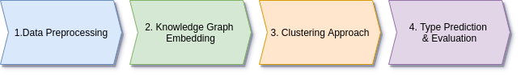

# DAIKIRI-Clustering


<p align="center">
  
</p>

## Overview
This project aims to predict entities types in knowledge graphs in unsupervised learning case (without labeled data). Our approach contains four main steps as depicted in Figure 1). 
- Data Preprocessing: generate a knowledge graph (e.g. RDF format) from tabular data. We used Vectograph libraries in this step, if the input data is not in RDF format. 
- Knowledge Graph Embedding (KGE): learn entities and relations representations using knowledge graph embedding models. In this step, we used graphvite (https://graphvite.io/) library to train three KGEs namely, transE, rotatE and DistMult. These pre-computed emebddings are store in Dataset folder for results reproducibility.
- Clustering Embeddings: We use a density-based clustering approach (HDSCAN) to cluster KGEs and generate embeddings clusters. 
- Type Prediction: Finally, we identify the most frequent type in each cluster and assign (propagate) it to all entities in the same clsuter (aka. Label Propagation). 

--- 
## Installation 
Install the requirements via ```pip install -r requirements.txt```

- **Vectograph**: Please follow the instructions described in https://github.com/dice-group/Vectograph This library is required to generate KG from your input data (if it is not in KG format)
- **Graphvite**: This library is used in step 2 to train KG and generate KG embeddigns. More information can be found here https://graphvite.io/docs/latest/install.html
 
## Dataset
We used three datasets in our experiments (two bechmark datasets for entity typing and on industrial). We describe each dataset briefly as follows: 

- **FB15k-237** A subset of Freebase Knowledge Graph contains 310,116 triples with 14,951 entities and 237 relations.
- **WN18RR** A subset of WordNet with 93k triples with 40,559 entities and 11 relations.
- **AI4BD** A balanced subset of an industrial dataset in the logistics domain with about 490,806 triples, 140,000 entities and 42 relations.

The preprocessed data (pre-computed embeddings) used in our experiments can be found in the *Dataset* folder. 

## Experiments and Results
We provide our experimetns as jupyter notebooks and can be found in *Experiments* folder. 

---
## Citation
```
@inproceedings{
  author    = {Hamada M.Zahera, Stefan Heindorf and Axel N.Ngonga},
  title     = {W-SET: a Weakly Supervisied Approach for Entity Typing in Knowledge Graphs},
  year      = {2021},
}
```

---
## Contact

If you have any further questions/suggestions, please contact `hamada.zahera@upb.de`
